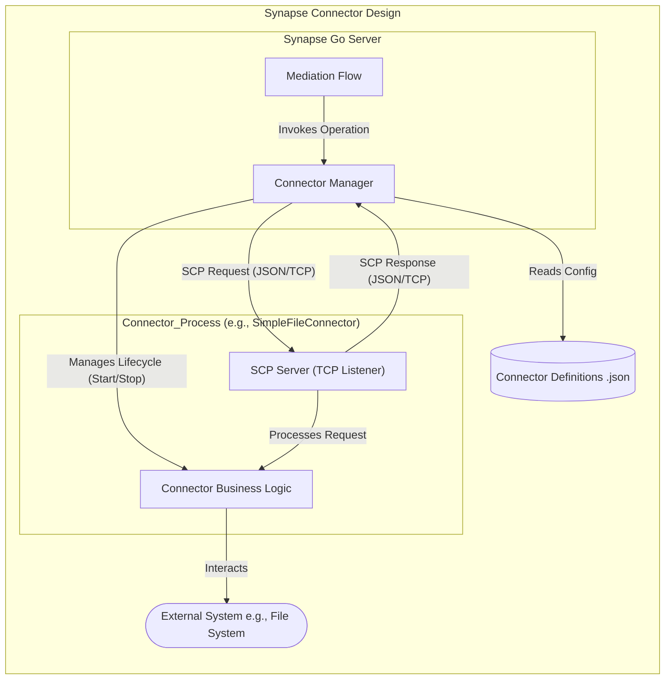

# Synapse Go Connector Framework - Proof of Concept

**Date:** May 7, 2025

## 1. Overview

This project is a Proof of Concept (PoC) demonstrating a potential architecture for a connector framework within a re-imagined Apache Synapse / WSO2 Micro Integrator (MI) built in Go. The primary goal is to explore how external services and systems can be integrated into a Go-based mediation engine in a modular, isolated, and manageable way.

This PoC focuses on an **out-of-process connector model**, where connectors run as separate executables and communicate with the main Synapse Go Server via a defined protocol.

## 2. High-Level Design

The core idea is to have a main Synapse Go Server that hosts the mediation engine. When a mediation flow requires interaction with an external system, it delegates this task to a specific connector through a `ConnectorManager`. The `ConnectorManager` is responsible for the lifecycle of connector processes and facilitating communication.



**Design Rationale:**

* **Out-of-Process:** Enhances stability (connector crash doesn't kill the server), allows for independent resource management, and opens the door for connectors in different languages (though this PoC uses Go).
* **IPC Protocol:** Uses JSON over TCP for simplicity in this PoC. The design anticipates evolving to gRPC for production due to its performance, strong typing, and features.
* **Centralized Management:** The `ConnectorManager` within the Synapse Go Server handles connector discovery, configuration, and invocation.

## 3. Project Structure

```
synapse-go-connector-poc/
├── go.mod                          # Root Go module file
├── protocol/                       # Shared Synapse Connector Protocol (SCP) definitions
│   └── protocol.go
├── synapse-server/                 # Main Synapse Go Server application
│   ├── main.go                     # Server entry point
│   └── connector_manager.go        # Logic for managing connectors
├── connectors/                     # Directory for connector implementations
│   └── simple-file-connector/      # A sample connector implementation
│       ├── main.go                 # Connector entry point
│       └── go.mod                  # Connector's Go module file
└── connector-definitions/          # Configuration files describing available connectors
    └── file_connector.json
```

## 4. Key Components

### 4.1. Synapse Go Server (`synapse-server/`)

* Hosts the main application logic (simulated mediation flow in this PoC).
* Contains the `ConnectorManager`.
* Initiates requests to connectors based on mediation requirements.

### 4.2. Connector Manager (`synapse-server/connector_manager.go`)

* **Discovery:** Reads connector definition files (JSON) to understand available connectors, their executables, default ports, and configurations.
* **Lifecycle Management:** Starts connector processes as needed. For this PoC, it pipes their stdout/stderr to the server's console. It also handles basic shutdown.
* **Communication Broker:** Forwards operation invocation requests from the server to the appropriate connector process using the SCP.

### 4.3. Sample Connector (`connectors/simple-file-connector/`)

* A standalone Go application that implements specific operations (e.g., `createFile`, `readFile`).
* Starts a TCP server on a specified port to listen for SCP requests from the `ConnectorManager`.
* Processes requests, interacts with the "external system" (in this case, the local file system), and sends SCP responses.
* Receives its port and any initial configuration via command-line arguments or default values.

### 4.4. Synapse Connector Protocol (SCP) (`protocol/protocol.go`)

A simple JSON-based request/response protocol for communication between the `ConnectorManager` and connector processes.

* **`MessageContext`**: Represents the data flowing through the Synapse engine.
    ```go
    type MessageContext struct {
        MessageID  string                 `json:"message_id"`
        Payload    []byte                 `json:"payload"`
        Properties map[string]interface{} `json:"properties"`
        Headers    map[string]string      `json:"headers"`
    }
    ```
* **`ConnectorOperationRequest`**: Sent from Server to Connector.
    ```go
    type ConnectorOperationRequest struct {
        ConnectorName   string                 `json:"connector_name"`
        OperationName   string                 `json:"operation_name"`
        ConnectorConfig map[string]interface{} `json:"connector_config"`
        OperationParams map[string]interface{} `json:"operation_params"`
        MessageContextIn MessageContext        `json:"message_context_in"`
    }
    ```
* **`ConnectorOperationResponse`**: Sent from Connector to Server.
    ```go
    type ConnectorOperationResponse struct {
        Success           bool           `json:"success"`
        MessageContextOut MessageContext `json:"message_context_out"`
        ErrorMessage      string         `json:"error_message,omitempty"`
    }
    ```

### 4.5. Connector Definitions (`connector-definitions/`)

JSON files that describe each connector type, including:
* `name`: Unique name of the connector.
* `executable_path_relative_to_connectors_dir`: Path to the connector's executable.
* `default_port`: The default TCP port the connector should listen on.
* `default_config`: Default key-value configurations for this connector type (e.g., base API URL, default directory).

Example (`file_connector.json`):
```json
{
    "name": "SimpleFileConnector",
    "executable_path_relative_to_connectors_dir": "simple-file-connector/simple-file-connector",
    "default_port": 9091,
    "default_config": {
        "baseDirectory": "./connector_runtime_data"
    }
}
```

## 5. How to Build and Run

### Prerequisites

* Go (version 1.20 or higher recommended) installed.
* A properly set up Go workspace.

### Build Steps

1.  **Clone the Repository (or create the structure):**
    Ensure you have the project structure as outlined above.

2.  **Initialize Go Modules:**
    ```bash
    # Navigate to the root project directory
    cd synapse-go-connector-poc

    # Initialize the root module (if you haven't already based on the provided go.mod)
    # go mod init [github.com/yourusername/synapse-go-connector-poc](https://github.com/yourusername/synapse-go-connector-poc)
    go mod tidy

    # Initialize the sample connector's module
    cd connectors/simple-file-connector
    # go mod init [github.com/yourusername/synapse-go-connector-poc/connectors/simple-file-connector](https://github.com/yourusername/synapse-go-connector-poc/connectors/simple-file-connector)
    go mod tidy
    cd ../..
    ```
    *Note: The `replace` directive in the connector's `go.mod` file allows it to find the local `protocol` package.*

3.  **Build the Sample Connector:**
    ```bash
    cd synapse-go-connector-poc/connectors/simple-file-connector
    go build -o simple-file-connector # (or simple-file-connector.exe on Windows)
    cd ../..
    ```
    This will create the `simple-file-connector` executable in the `connectors/simple-file-connector/` directory.

4.  **Build the Synapse Go Server:**
    ```bash
    cd synapse-go-connector-poc/synapse-server
    go build -o synapse-server # (or synapse-server.exe on Windows)
    cd ../..
    ```
    This will create the `synapse-server` executable in the `synapse-server/` directory.

### Running the PoC

1.  **Navigate to the Server Directory:**
    ```bash
    cd synapse-go-connector-poc/synapse-server
    ```

2.  **Ensure Configuration is Present:**
    * The `connector-definitions` directory should be present at `../connector-definitions` relative to the `synapse-server` executable (i.e., `synapse-go-connector-poc/connector-definitions/`).
    * The `file_connector.json` should be inside this directory.
    * The compiled `simple-file-connector` executable should be at `../connectors/simple-file-connector/` relative to the `synapse-server` executable.

3.  **Run the Server:**
    ```bash
    ./synapse-server # (or .\synapse-server.exe on Windows)
    ```

**Expected Behavior:**

* The Synapse Go Server will start and initialize the `ConnectorManager`.
* The `ConnectorManager` will read `file_connector.json` and launch the `simple-file-connector` process.
* Logs from both the server and the connector will appear in the console.
* The simulated mediation flow in the server will invoke operations on the file connector:
    * A file named `poc_output.txt` will be created in a directory named `connector_runtime_data` (created in the same directory where `synapse-server` is run, e.g., `synapse-go-connector-poc/synapse-server/connector_runtime_data/`).
    * The content of this file will then be read back and logged by the server.
* Press `Ctrl+C` to shut down the server, which will also attempt to terminate the connector process.

## 6. Key Design Choices & Justifications

* **Out-of-Process Connectors:**
    * **Pros:** Isolation (stability), potential for language-agnostic connectors, independent resource management, simpler updates of individual connector binaries.
    * **Cons:** IPC overhead (mitigated by efficient protocols like gRPC in production), more complex process management.
* **JSON over TCP for IPC (PoC):**
    * **Pros:** Simple to implement and debug for a PoC, human-readable.
    * **Cons:** Less performant than binary protocols, lacks strong typing enforcement at the protocol level without careful schema validation.
* **Configuration-Driven:**
    * Connector definitions are externalized in JSON files, allowing new connectors to be described without server code changes (though their executables still need to be built and deployed).
* **Simplified Protocol (SCP):**
    * Focuses on core interaction elements: identifying connector/operation, passing configurations and parameters, and exchanging a message context.

## 7. Future Considerations / Production Roadmap

This PoC is a starting point. For a production-grade system:

1.  **Switch to gRPC:** Replace JSON/TCP with gRPC for efficient, typed, and feature-rich IPC. This involves:
    * Defining SCP using Protocol Buffers (`.proto` files).
    * Generating Go client/server stubs.
2.  **Connector SDK:** Develop a Go library (SDK) for connector authors. This SDK would abstract gRPC communication, provide helpers for message context manipulation, configuration handling, and logging, allowing developers to focus on the core logic of interacting with the target external system.
3.  **Service Discovery & Dynamic Ports:** Instead of fixed ports, connectors could acquire dynamic ports upon startup and register themselves with the Synapse Go Server (or a dedicated service discovery tool like Consul, etcd).
4.  **Robust Process Management:**
    * Implement comprehensive health checks (e.g., a gRPC health check service on each connector).
    * Automatic restart policies for failed connectors with backoff mechanisms.
    * Resource limiting (CPU, memory) for connector processes using OS features or containerization.
5.  **Security:**
    * Secure IPC: mTLS for gRPC communication.
    * Secure credential management for connectors (e.g., integration with HashiCorp Vault or similar secrets management systems).
    * Input validation and sanitization at both server and connector levels.
6.  **Advanced Configuration Management:**
    * A more sophisticated system for managing global and instance-specific connector configurations.
    * Support for dynamic configuration updates without restarting connectors/server where possible.
7.  **Observability:**
    * Standardized structured logging across the server and all connectors.
    * Exporting metrics (e.g., Prometheus format) for request latency, error rates, resource usage.
    * Distributed tracing (e.g., OpenTelemetry) to follow requests across the server and connector processes.
8.  **Hot Deployment & Versioning:**
    * Mechanisms to deploy new connector versions or new connector types with minimal or zero downtime for the main server.
9.  **Error Handling and Resilience:**
    * Standardized error codes and retry mechanisms within SCP.
    * Circuit breaker patterns for calls to connectors.
10. **Scalability:**
    * Design the `ConnectorManager` to handle a large number of connector types and instances.
    * Consider strategies for load balancing requests across multiple instances of the same connector if needed.

## 8. Assumptions & Limitations of this PoC

* **Single Instance per Connector Type:** The PoC `ConnectorManager` starts only one instance of each defined connector.
* **Fixed Ports (Mostly):** Relies on the `default_port` in the connector definition. No dynamic port negotiation or service discovery.
* **Basic Process Management:** Rudimentary start, stop, and check for exited state. No sophisticated health checking or automatic restarts.
* **Local Communication:** Assumes Synapse Server and connectors run on the same host.
* **Simplified Error Handling:** Basic error propagation; a production system would need more detailed error types and handling strategies.
* **No Security:** Communication is unencrypted plain TCP. No authentication/authorization between server and connector.
* **Synchronous Invocation:** The server blocks while waiting for a connector's response.
* **Limited MessageContext:** The `MessageContext` is basic and doesn't handle complex scenarios like streaming payloads or different payload types explicitly (though `Payload []byte` is flexible).

This PoC serves as a tangible starting point for discussion and iteration on the path to a modern, Go-based integration platform.
